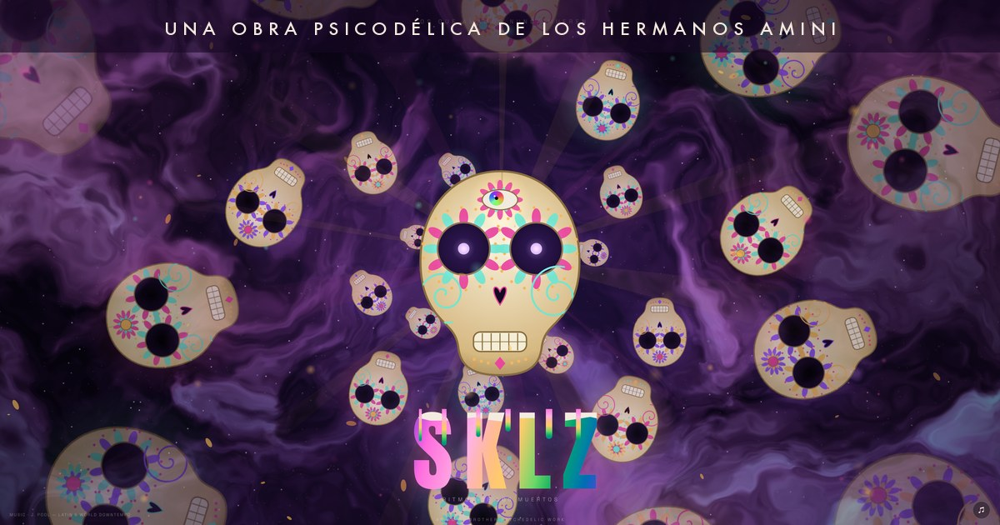

# HermanosAmini

<p align="center">
  <a href="https://hermanosamini.com"></a>
</p>

<p align="center">
  <a href="https://runmaestro.ai"></a>
</p>

**UNA OBRA PSICODÉLICA DE LOS HERMANOS AMINI**

### [hermanosamini.com](https://hermanosamini.com)

An infinite Día de los Muertos altar adrift in deep space. A living calavera
watches you, chatters, and throws a grito; an endless tunnel of sugar skulls
drifts past; nebula smoke stirs when you move through it. Everything breathes
with the music.

---

## Where this came from

[**Neema Amini**](https://aminiconant.com) sent his brother
[**Pedram Amini**](https://pedramamini.com) a three-hour downtempo mix, *Ritmos De Los Muertos* by [J. Pool](https://www.youtube.com/watch?v=2Yza5xXfezc), built for Día de los Muertos, the day you remember the people you've lost and
keep them alive by saying their names.

Pedram is a security researcher who mostly builds things that break other
things. He put the mix on, and it turned into this instead: skulls, smoke, and
a three-hour groove. Neema is already scheming to wire a Kinect to it so the
skull tracks whoever walks into the room.

Two brothers, one long song. *Los que amamos nunca mueren.*

---

## The point: it's not finished, and that's deliberate

Most generative art is something you look at. This is something you **argue
with**.

1. **Look at it.** Skulls, nebula, sky events, a face that notices you.
2. **Play with it.** 59 live dials, 8 palettes, 5 backgrounds, voice control,
   and a gallery of boards other people built. Break it however you want; nothing you do is
   permanent.
3. **Ask it for something it doesn't have.** Tell it you want a comet that
   sheds marigold petals, or a skull that hums along. That request becomes a
   **public GitHub issue** in this repo.
4. **It comes back changed.** Approved requests get built by AI agents, merged,
   tagged, and deployed to the live site. The thing you asked for shows up in
   the art, and you get told when it does.

That's the loop. You talk to the piece, and over time the piece becomes partly
yours. Every deployment leaves it recognizably itself with one more thing alive
in it.

**The catch, and it's on purpose:** the Hermanos Amini are the artists. Anyone
can ask; nothing is built until one of the brothers puts the `approved` label
on the issue. That gate is enforced by CI, not by good manners. See
[ART_DIRECTION.md](ART_DIRECTION.md) for what will and won't be accepted, short version, the two themes (Día de los Muertos and deep space) don't bend,
and the music stays Latin downtempo.

---

## Run it

```bash
git clone https://github.com/pedramamini/HermanosAmini
cd HermanosAmini
python3 -m http.server 8765     # open http://localhost:8765
```

One self-contained `index.html`. No build step, no dependencies, no framework.
It runs silently without audio, see [Audio](#audio) below.

## Play with it

| Key | | | Key | |
|---|---|---|---|---|
| `A` | aurora | | `P` | petal burst |
| `B` | alebrije spirit | | `Q` | galactic battle |
| `C` | settings + presets | | `R` | spin the eye rings |
| `D` | fps / quality monitor | | `S` | shooting star |
| `E` | rainbow third eye | | `T` | teeth chatter |
| `F` | flick a random skull | | `U` | UFO (2+ dogfight) |
| `G` | grito | | `V` | supernova |
| `I` | save a photo | | `W` | whirl the cheek spirals |
| `J` | flood with skulls | | `X` | meteor shower |
| `K` | comet | | `Y` | mean mug |
| `L` | keyword voice | | `Z` | zen mode (hide text) |
| `M` | mute all sound | | `Enter` | surprise me |
| `N` | nose heart burst | | `Space` | play / pause |
| `O` | roll a whole new look | | `Esc` | close the open panel |
| `Shift`+`L` | agentic chat on/off | | hold `.` | push-to-talk |
| `←` `→` | skull size | | `↑` `↓` | music volume |
| `Shift`+`J` | clear the flood | | `Shift`+`Q` | clear the sky |
| `!` | fiesta: new look + everything + grito | | | |
| `Shift`+`O` | demo mode: a new look every 60s | | | |
| `Shift`+`I` | record a clip (20s max, with sound) | | | |
| `H` or `?` | this list, in the piece | | | |

The full list lives on `?` in the piece itself, alphabetized.

Two toggles in the settings drawer change the skull itself: **skull always on
top** keeps every spirit, spark, and saucer behind the hero calavera, and
**skull breathing** makes it swell and shrink at whatever pace you set on the
breathing dial.

Click the art: the eyes follow you, face parts react, skulls flick away.
Click the microphone to pick how you talk to it:

- **Keyword commands** listen for single words. Say "grito", "ufo", or
  "supernova" and the art responds.
- **Agentic chat** opens a conversation in the bottom right. Ask for what you
  want in plain language ("dim the smoke", "make everything more purple") and
  it changes the piece while it answers. Type or talk; it talks back unless you
  mute it. Ask for something that does not exist yet and it files that as a
  request for the artists instead of pretending.

The chat can only turn dials that already exist. It cannot retheme the piece,
and it is told to refuse if you ask.

### Galactic Battle

`Q` scrambles three fleets, sixteen saucers each, one to a corner of the sky.
They close on each other, open fire, juke incoming lasers, and take two or three
hits to go down. The calavera is solid cover: a saucer in front of the skull and
one behind it cannot shoot through it, so they have to fight around the head.

The fleets are named for what sits on an ofrenda: **Los Copales** (green, the
incense whose smoke guides the dead home), **Las Catrinas** (rose, the elegant
skeleton), and **Los Cempasúchiles** (gold, the marigold that lights the path).
It runs about half a minute, and when one fleet is left standing the survivors
throw marigold petals and a toast slides in from the top right: the victor's
name in their own colour, a running scoreboard of every fleet's wins, and a
timer bar that drains before the toast slides back out. The tally is kept in
the browser, so the standings build across every battle you run. `Shift`+`Q`
calls it off early, with no winner declared.

### Five Backgrounds

The deep-space layer has five looks, on the `background` dial or by asking the
chat: **smoke** (the original marbled nebula), **galaxy** (a slow spiral with an
amber core), **aurora veil** (green and violet curtains), **candlelight** (the
warm flicker of an ofrenda after dark), and **the void** (near-black, thick
with stars). All five share the same flow field, so the cursor still stirs them
and they still breathe with the bass.

### Ask It to Redesign Itself

Tell the chat "change up the design" or say "restyle" out loud and it rolls a
new coherent look: palette, hues, background, and glow together. Design asks
change what the piece looks like; effect asks make things happen in it. The
agent knows the difference.

### The Skull Watches You (Human Tracking)

The page auto-connects to `ws://localhost:8181` and retries forever, so a tiny
local bridge can drive the art with zero page setup. Two bridges ship in
[`bridge/`](bridge/):

**Webcam (any laptop, two minutes):**

```bash
git clone https://github.com/pedramamini/HermanosAmini
cd HermanosAmini/bridge
pip install opencv-python websockets
python3 webcam_bridge.py          # macOS asks once for camera access
```

Then open [hermanosamini.com](https://hermanosamini.com). Walk left and the
skull's eyes follow you; walk toward the screen and it glares. No hardware
beyond the webcam you already have. `python3 webcam_bridge.py --fake` runs a
scripted ghost so you can test the pipeline with no camera at all. If Chrome
asks to allow connections to your local network, say yes: that permission is
exactly this feature.

**Kinect (better range, low light, multiple people):** `kinect_bridge.py`,
Windows + Kinect v2 + the Kinect SDK 2.0. Same protocol.

Any tracker works, honestly. The whole contract is one JSON object per
message on `ws://localhost:8181`: `{x, y}` in 0..1 aims the eyes, `{z}` in
meters under 1.2 earns the stare, `{stir}` churns the smoke, `{effect}` fires
any named effect. Point a pose model, lidar, or a potato at it. An Xbox
controller needs no bridge at all: the Gamepad API works natively.

### Everything at Once

Ask the chat for "everything" (or say "fiesta") and the piece fires the whole
catalogue in a 1.5 second crescendo: grito, comet, UFOs, aurora, supernova,
meteor shower, petals, an alebrije, a skull flood, and a three-fleet battle.
Every population cap still applies, so it saturates rather than melting down.

### Gesture Percussion

Touching the face plays it. The eye rings shake a maraca, the cheek spirals
scrape a guiro, the teeth clatter like bone, the heart nostril thumps a low tom,
the third eye rings a bell. Flicking a background skull knocks like wood.

Every one of those is synthesized in the browser with Web Audio, not sampled.
The piece ships no percussion files and vendors no audio.

Sounds fire on your gestures only, whether you click or use the keyboard. When
the art chatters its own teeth or stares at you on its own schedule it stays
silent, so the audio always means "you did that". Level lives on the
`gesture sfx volume` dial, and the mute button silences them along with
the music and the gritos.

### Demo Mode

`Shift`+`O` rolls a whole new look every sixty seconds, the same roll the dice
button gives you, so a piece left running on a wall or a projector never settles
on one palette. A small amber tell sits in the top left while it is on; press
`Shift`+`O` again to stop. It is deliberately not remembered between visits: a
page that started reskinning itself on load would read as a bug rather than a
setting.

### Take a Photo or a Clip

`I` saves a full-resolution PNG of the exact frame you are looking at. `Shift`+`I`
starts recording and saves an MP4 when you press it again or when it hits the
20 second cap; a red tally in the corner shows it is running, and does not
appear in the recording. Both are composited by hand from the four canvas
layers, with the wordmark, signature, and QR drawn in, so a capture looks like
the piece rather than like a screenshot of a browser.

Clips carry the sound: the music, the gritos, and the gesture percussion, all
tapped from the same master bus you are listening to. Mute the piece and the
clip records silent, so the file always matches what you heard.

### Take It as a Screensaver

Native screensavers for both platforms live in
[`screensaver/`](screensaver/). Each is a thin webview shell pointed at
`hermanosamini.com/?kiosk=1`, a mode where the page walks through its own
enter gate, hides every control, and hides the cursor. Silent by design; the
art keeps evolving because a screensaver runs the live site, not a copy.

**macOS** (`SKLZ.saver`, signed and notarized): download from the
[latest release](https://github.com/pedramamini/HermanosAmini/releases/latest), unzip,
double-click, and System Settings offers to install it. No Gatekeeper warning:
it carries a stapled Apple notarization ticket. Or build it yourself:

```bash
cd screensaver/macos && ./build.sh    # needs Xcode command line tools
```

**Windows** (`SKLZ.scr`): download from the
[latest release](https://github.com/pedramamini/HermanosAmini/releases/latest), right-click the `.scr`,
choose **Install**. Needs the WebView2 runtime, which Windows 11 and updated
Windows 10 already have. Unsigned, so SmartScreen will ask once. Or
cross-compile from a Mac:

```bash
brew install mingw-w64
cd screensaver/windows && ./build.sh
```

Any key or a real mouse move exits, as a screensaver should.

## How It's Built

One `index.html`, ~5,000 lines, zero dependencies, no build step. That is a
deliberate constraint, not a dare. A reader's map of the source lives in the
header comment at the top of the `<script>`; the short version:

- **Four stacked canvases**: a WebGL nebula (domain-warped fbm, five looks
  behind one uniform), the infinite skull tunnel, the living face, and a
  foreground particle layer. Spawned effects pick a random depth: the spark
  loop retargets its drawing context per object, which is how one boolean put
  everything either in front of or behind the hero skull without touching ~250
  draw calls.
- **Beat detection on flux**, the rate bass rises, not level vs a running mean
  (level-based dies on compressed masters). It samples on its own 60Hz timer
  because the render loop can idle at 15fps on a 5K display.
- **Sprites and flipbooks over per-frame paths**: skulls are baked variants,
  saucers are 8-frame flipbooks. The difference is 35ms vs 1.7ms per frame at
  full battle scale.
- **A 5-tier quality ladder** with an FPS governor that walks down under 32fps
  and back up with headroom, so the same file runs on a 5K studio display and
  an old TV browser.
- **The agentic chat runs on Workers AI** with no key in the client. The model
  only proposes `{say, actions[]}`; the page validates every action against
  its own schema. A jailbroken reply cannot reach past knobs that exist.
- **Every spawnable has a population cap.** Six trigger sources firing at once
  saturates; it never melts down.
- **All percussion is synthesized** in Web Audio at runtime. The repo ships
  zero bytes of audio and never will.

## Audio

The soundtrack is **"Ritmos De Los Muertos" by J. Pool** and the gritos are
sourced clips. **None of it is ours to redistribute**, so no audio lives in
this repo and none should ever be committed. It's credited on the page and
streamed from our own origin. To run locally with sound, supply your own files
at the paths in `index.html`.

## Contributing

Read [ART_DIRECTION.md](ART_DIRECTION.md) first. It's short and it's the whole
deal. Then open an issue describing what you want to see, as a viewer, not as
code. If it fits the piece and one of the brothers approves it, it gets built.

## Releases

Every deployment is tagged, so any change rolls back to the exact bytes that
were live.

## License

MIT for the code. The artwork, the name, and the audio are not covered by it.
